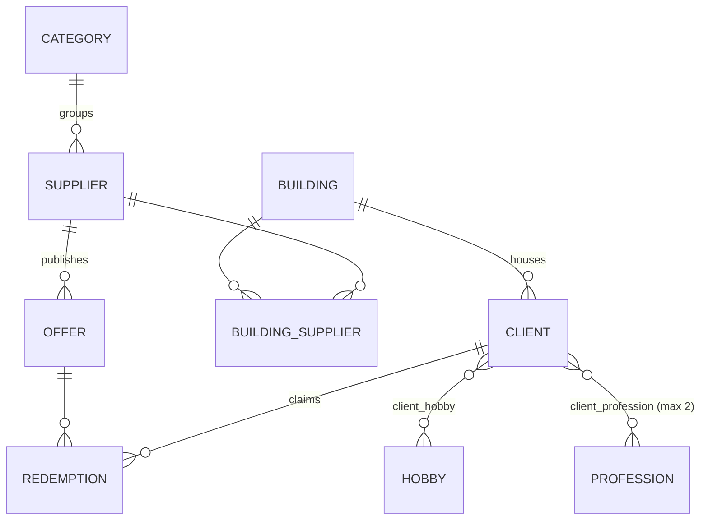

# Domain Model

Resident-business discount platform. Buildings host residents (Clients); Suppliers — grouped in Categories — partner with Buildings to publish Offers that Clients Redeem.

## Entity-relationship diagram

## Entities

| Entity                   | Table               | Key fields / constraints                                                                            | Notes                                                                |
|--------------------------|---------------------|-----------------------------------------------------------------------------------------------------|----------------------------------------------------------------------|
| `BuildingEntity`         | `building`          | `name`, `address`, `city` (indexed)                                                                 | Owns `clients` and `buildingSuppliers` (cascade ALL, orphanRemoval)  |
| `ClientEntity`           | `clients`           | `rut` UNIQUE, `email` UNIQUE, `phone` regex, `genre` (enum→int), FK `id_building` NOT NULL          | Owns `redemptions`                                                   |
| `SupplierEntity`         | `supplier`          | `contactEmail` UNIQUE, `phone` regex, FK `id_category` NOT NULL                                     | Owns `offers` and `buildingSuppliers`                                |
| `OfferEntity`            | `offer`             | `discountPercentage`, `validFrom`/`validTo` (indexed), `quantityAvailable`, FK `id_supplier`        | Owns `redemptions`                                                   |
| `RedemptionEntity`       | `redemption`        | `redeemedAt`, `status` enum (indexed), FKs `id_offer` + `id_client`                                 | **Does NOT extend `BaseEntity`** (audit fields absent)               |
| `Category`               | `category`          | `name`                                                                                              | Class name has no `Entity` suffix (inconsistent with conventions)    |
| `BuildingSupplierEntity` | `building_supplier` | Composite PK `BuildingSupplierId(buildingId, supplierId)` via `@EmbeddedId` + `@MapsId`, `joinedAt` | Join entity, not a plain `@ManyToMany` (carries `joinedAt`)          |
| `HobbyEntity`            | `hobby`             | `name` UNIQUE                                                                                       | Lookup table                                                         |
| `ProfessionEntity`       | `profession`        | `name` UNIQUE                                                                                       | Lookup table                                                         |

`BuildingEntity`, `ClientEntity`, `SupplierEntity`, and `OfferEntity` extend `BaseEntity` (audit fields `createdAt`, `updatedAt` via `@EnableJpaAuditing`). The rest do not.

## Enums

| Enum               | Values                                        | Persistence                                                                        |
|--------------------|-----------------------------------------------|------------------------------------------------------------------------------------|
| `Genre`            | `MALE(1)`, `FEMALE(2)`, `OTHER(3)`            | Stored as `int` via `GenreConverter` (auto-applied `@Converter(autoApply = true)`) |
| `RedemptionStatus` | `PENDING`, `REDEEMED`, `EXPIRED`, `CANCELLED` | Stored as `STRING` (`@Enumerated(EnumType.STRING)`)                                |

## Business rules (implicit in code — single source of truth)

| Rule                                                                | Enforced in                                |
|---------------------------------------------------------------------|--------------------------------------------|
| Client `email` must be unique                                       | `ClientService.createClient` + DB UNIQUE   |
| Client `rut` must be unique and pass modulo-11 validation           | `ClientService.createClient` + `Util.java` |
| A Client may have **at most 2 Professions**                         | `ClientService.java:89`                    |
| A Client must belong to an existing Building                        | `ClientService.createClient`               |
| Genre persists as integer code, not ordinal or name                 | `GenreConverter` (auto-applied)            |
| Chilean RUT format: digits + dash + check digit (e.g. `12345678-9`) | `Util.java` (normalize + validate)         |
| Phone format: `^\+?[0-9]{9,12}$`                                    | `@Pattern` on Client + Supplier            |
| Building→Supplier link is timestamped (`joinedAt`)                  | `BuildingSupplierEntity`                   |
| Redemption is the only place Offer quota would be decremented       | (not yet implemented)                      |

## Fetch & cascade conventions

- All `@ManyToOne` and collections use `FetchType.LAZY`.
- Parent entities use `CascadeType.ALL` + `orphanRemoval=true` on owned collections (Building→Clients, Building→BuildingSuppliers, Supplier→Offers, Supplier→BuildingSuppliers, Offer→Redemptions, Client→Redemptions, Category→Suppliers).
- Lazy collections require an active transaction or `@EntityGraph` / fetch join when accessed outside the service layer.

## Known gaps

- `RedemptionEntity` does not extend `BaseEntity` → no `createdAt`/`updatedAt`.
- `Category` lacks the `Entity` suffix used everywhere else.
- No `@Version` field anywhere → no optimistic locking.
- Offer `quantityAvailable` has no decrement logic yet.
- No DB-level UNIQUE on `(client, offer)` for Redemption → the same client could redeem same offer multiple times.